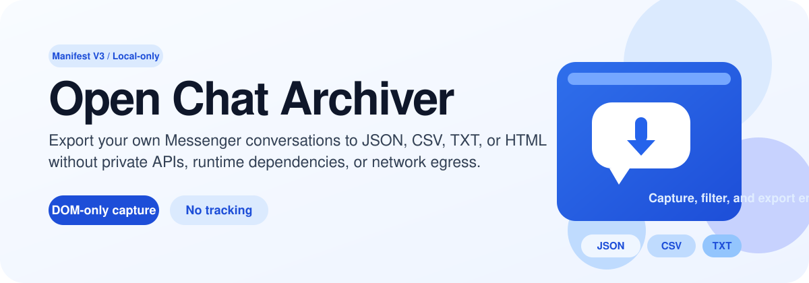
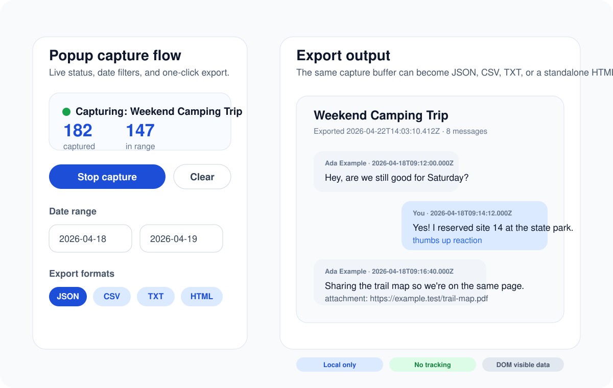

<div align="center">
  

  <h1>Open Chat Archiver</h1>

  <p>A dependency-free Manifest V3 Chrome extension that exports your own Facebook / Messenger conversations to JSON, CSV, TXT, or HTML using DOM-only capture.</p>

  <p>
    <a href="https://github.com/tyhallcsu/messages-saver-open-source/actions/workflows/ci.yml"></a>
    <a href="./LICENSE"></a>
    <a href="https://developer.chrome.com/docs/extensions/mv3/intro/"></a>
    <a href="./PRIVACY.md"></a>
  </p>

  <p>
    <a href="#install">Install</a> /
    <a href="#usage">Usage</a> /
    <a href="#export-formats">Formats</a> /
    <a href="#privacy-and-guardrails">Privacy</a> /
    <a href="#development">Development</a>
  </p>
</div>

Open Chat Archiver runs entirely inside your browser session. It reads only the conversation content already rendered in your own Messenger or Facebook tab, keeps settings in `chrome.storage.local`, and writes exports through Chrome's Downloads API.

> This project is an independent clean-room implementation. It is not affiliated with, endorsed by, or derived from Meta Platforms, Inc. "Facebook" and "Messenger" are used only to describe the sites the extension can read from.

## At a glance

| Surface | Value |
| --- | --- |
| Status | Pre-1.0 (`manifest.json` version `0.1.0`) |
| Platform | Chrome extension, Manifest V3 |
| Capture model | DOM-only, rendered messages only |
| Export formats | JSON, CSV, TXT, HTML |
| Local storage | `chrome.storage.local` |
| Permissions | `storage`, `downloads`, `activeTab`, scoped Facebook / Messenger hosts |
| Release flow | Tag-driven GitHub Actions packaging |
| License | MIT |

## Highlights

- Export a captured conversation as JSON, CSV, TXT, or standalone HTML.
- Filter by date range before download without sending data anywhere.
- Use optional paced auto-scroll to load older messages more gently.
- Capture visible reactions and attachment URLs without downloading attachment bytes.
- Keep the extension fully local: no analytics, no feature flags, no remote endpoints, no runtime dependencies.

## Preview

<p align="center">
  
</p>

## Install

There is no build step. Load the extension source directly in Chrome.

```bash
git clone https://github.com/tyhallcsu/messages-saver-open-source.git
cd messages-saver-open-source
```

1. Open `chrome://extensions`.
2. Enable **Developer mode**.
3. Click **Load unpacked**.
4. Select this repository folder.

The repository also includes a tag-driven release workflow in [`.github/workflows/release.yml`](./.github/workflows/release.yml). Once a `v*` tag is pushed, GitHub Actions packages a versioned ZIP and SHA256 checksum for the release page.

## Usage

1. Open a conversation on `https://www.messenger.com/t/<thread>` or `https://www.facebook.com/messages/t/<thread>`.
2. Click the extension icon and choose **Start capture**.
3. Scroll upward to load older messages, or enable paced auto-scroll in **Options**.
4. Optionally set **From** and **To** dates in the popup.
5. Choose an export format and click **Download export**.

The full end-user walkthrough lives in [docs/USAGE.md](./docs/USAGE.md).

## Export formats

| Format | Best for | Sample |
| --- | --- | --- |
| JSON | Archival, scripting, schema-stable exports | [sample-conversation.json](./sample-data/sample-conversation.json) |
| CSV | Spreadsheets, filtering, diffs | [sample-conversation.csv](./sample-data/sample-conversation.csv) |
| TXT | Readable transcripts | [sample-conversation.txt](./sample-data/sample-conversation.txt) |
| HTML | Standalone viewing and printing | [sample-conversation.html](./sample-data/sample-conversation.html) |

JSON exports carry the schema string `open-chat-archiver/1`. The canonical shape is documented in [docs/ARCHITECTURE.md](./docs/ARCHITECTURE.md) and mirrored in [sample-data/README.md](./sample-data/README.md).

## How it works

The extension splits work across three contexts:

1. `content.js` reads only the rendered conversation DOM, extracts messages, and maintains the in-tab capture buffer.
2. `popup.js` lets you start capture, filter by date, and request an export from the active tab.
3. `background.js` serializes the filtered messages and hands the result to `chrome.downloads.download()` as a local `data:` URL.

For the fuller data flow, see [docs/ARCHITECTURE.md](./docs/ARCHITECTURE.md).

## Privacy and guardrails

- No network egress. The extension does not call `fetch`, `XMLHttpRequest`, `WebSocket`, `navigator.sendBeacon`, or any remote script source.
- No private API scraping. The content script reads only the DOM already visible in your signed-in browser session.
- No broad permissions. Host permissions are limited to the Facebook / Messenger surfaces needed for capture.
- No attachment downloading. Exports record visible attachment URLs only.

The ground-truth policy lives in [PRIVACY.md](./PRIVACY.md). Security reporting instructions live in [SECURITY.md](./SECURITY.md).

## Development

Edit the source files and reload the unpacked extension in Chrome. There is no bundler or build pipeline.

Regenerate icons after changing the icon script:

```bash
python3 scripts/generate_icons.py
```

Build the release bundle locally:

```bash
python3 scripts/build_release.py --out-dir dist
```

The CI workflow validates the manifest, sample exports, icon generation, release bundle creation, forbidden network APIs, and host permission scope. See [`.github/workflows/ci.yml`](./.github/workflows/ci.yml).

## Project layout

```text
manifest.json            MV3 manifest and extension metadata
background.js            Service worker serializers and download handoff
content.js               DOM capture, filtering, and tab-local buffer
popup.*                  Toolbar popup UI
options.*                Options page UI
icons/                   Generated extension icons
scripts/                 Stdlib-only maintenance scripts
sample-data/             Synthetic example exports
docs/                    Architecture and usage notes
```

## Contributing

Public contributions are welcome as long as they preserve the local-only, dependency-free design. Start with [CONTRIBUTING.md](./CONTRIBUTING.md).

## Author

Maintained by **sharmanhall**.

## License

Released under the MIT License. See [LICENSE](./LICENSE).
